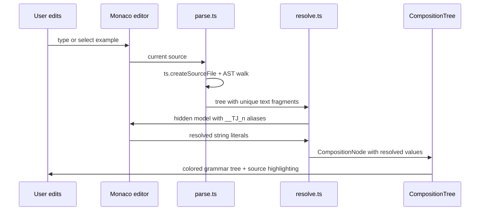

# Playground

Active contributors: Yifeng Wang

The playground is a Vite + React app that turns the Typed Japanese type library into a learning surface. It runs a real TypeScript compiler in the browser and uses it to check, resolve, and visualize Japanese sentences.

## Directory layout

```
playground/
├── index.html
├── package.json
├── vite.config.ts
├── tsconfig.json
├── DESIGN.md
├── src/
│   ├── App.tsx              # tab shell and header
│   ├── main.tsx             # React entry point
│   ├── monaco-setup.ts      # self-hosted Monaco + themes
│   ├── theme.css            # Washi & Sumi design tokens
│   ├── App.module.css
│   ├── analysis/
│   │   ├── parse.ts         # build the composition tree from source
│   │   └── resolve.ts       # resolve tree values via Monaco's TS worker
│   ├── components/
│   │   ├── Tutorial.tsx     # grammar course UI
│   │   ├── Glossary.tsx     # vocabulary table UI
│   │   ├── Playground.tsx   # analyzer page shell
│   │   ├── Analyzer.tsx     # Monaco editor + composition tree
│   │   ├── CompositionTree.tsx
│   │   └── VocabWord.tsx
│   ├── context/
│   │   ├── lang.tsx         # EN / ZH language context
│   │   └── theme.tsx        # light / dark theme context
│   ├── data/
│   │   ├── libSources.ts    # typed-japanese .d.ts files as extra libs
│   │   └── examples.ts      # starter examples for the analyzer
│   ├── tutorial/
│   │   ├── types.ts         # Chapter / Example / GrammarPoint types
│   │   ├── levels.ts        # elementary / intermediate / advanced metadata
│   │   └── chapters/        # 47 chapter modules
│   └── vocab/
│       ├── dictionary.ts    # merged vocabulary table
│       ├── function-words.ts
│       ├── extract.ts       # word extraction from course examples
│       ├── types.ts
│       └── entries/         # authored content words
```

## Key abstractions

| Type | File | Purpose |
| --- | --- | --- |
| `CompositionNode` | `playground/src/analysis/parse.ts` | One node in the analyzer tree: label, grammar category, source span, children, and resolved value |
| `GrammarCategory` | `playground/src/analysis/parse.ts` | Classification for coloring nodes (phrase, conjugation, verb, adjective, particle, etc.) |
| `Chapter` | `playground/src/tutorial/types.ts` | A chapter with level, order, bilingual titles, summary, and grammar points |
| `Example` | `playground/src/tutorial/types.ts` | A sentence with Japanese, readings, bilingual translations, and a self-contained code snippet |
| `VocabEntry` | `playground/src/vocab/types.ts` | A word with surface, reading, romaji, part of speech, and meanings |

## How the analyzer works

The analyzer is the most technically involved part of the playground. It has three stages:

1. **Parse** — `playground/src/analysis/parse.ts` calls `ts.createSourceFile` on the editor text and walks the type alias declarations. It builds a `CompositionNode` tree for the last alias, following local alias references and expanding the grammar constructors (`ConjugateVerb`, `ConditionalPhrase`, etc.).
2. **Resolve** — `playground/src/analysis/resolve.ts` collects every unique type expression in the tree, appends throwaway aliases like `type __TJ_0 = ...;` to a hidden Monaco model, and reads the resolved string literal from Monaco's TypeScript worker using `getQuickInfoAtPosition`.
3. **Render** — `playground/src/components/CompositionTree.tsx` draws the indented, color-coded tree. Selecting a node highlights its source span in the Monaco editor.



## Grammar course

The course has 47 chapters split into three levels: elementary (🌱), intermediate (🌿), and advanced (🌳). Each chapter contains one or more grammar points, and each point has bilingual explanations and example sentences. Every example carries a self-contained Typed Japanese snippet that resolves to the displayed sentence. Clicking an example opens the analyzer drawer with the snippet loaded.

The course content is authored in `playground/src/tutorial/chapters/` as default-exported `Chapter` objects. The authoring guidelines are in `playground/src/tutorial/AUTHORING.md`.

## Glossary

The glossary is a merged vocabulary table keyed by word surface. It combines hand-maintained function words (`playground/src/vocab/function-words.ts`) with authored content words under `playground/src/vocab/entries/`. Each entry stores the word, kana reading, romaji, part of speech, and bilingual meaning.

Two verification scripts ensure the course and glossary stay consistent:

- `pnpm verify:snippets` — every course snippet type-checks and resolves to its displayed sentence.
- `pnpm verify:vocab` — every word used in the course is indexed in the glossary.

## Self-hosted Monaco

The playground does not load Monaco from a CDN. Instead, `playground/src/monaco-setup.ts` imports the editor and TypeScript workers directly as Vite workers. This avoids cross-origin worker failures and makes type-checking work offline. It also registers the Typed Japanese `.d.ts` files as extra libs so the in-browser compiler can resolve imports like `import type { ConjugateVerb } from "typed-japanese"`.

## Integration points

- The playground depends on the core library files under `src/` through `playground/src/data/libSources.ts`.
- The design system is documented in `playground/DESIGN.md` and implemented in `playground/src/theme.css`. See the [design system](../systems/design-system.md) page.
- The analyzer reuses the same grammar category names the type system uses, so the tree visualization matches the code structure.

## Entry points for modification

- To add a new tab or change the shell, edit `playground/src/App.tsx`.
- To add a new chapter, create a file in `playground/src/tutorial/chapters/` and import it in the barrel file.
- To change how the analyzer parses a constructor, edit `playground/src/analysis/parse.ts` and update the `COMPOSITIONAL` / `CATEGORY_BY_NAME` maps.
- To change how values are resolved, edit `playground/src/analysis/resolve.ts`.

## Key source files

| File | Purpose |
| --- | --- |
| `playground/src/App.tsx` | App shell with tabs, language toggle, and theme toggle |
| `playground/src/components/Analyzer.tsx` | Monaco editor + analyzer orchestration |
| `playground/src/components/CompositionTree.tsx` | Renders the resolved grammar tree |
| `playground/src/analysis/parse.ts` | Parses source and builds the composition tree |
| `playground/src/analysis/resolve.ts` | Resolves type fragments via Monaco's TS worker |
| `playground/src/data/libSources.ts` | Loads the core library into Monaco as extra libs |
| `playground/src/tutorial/types.ts` | Content model for the grammar course |
| `playground/src/vocab/dictionary.ts` | Merged vocabulary table |
