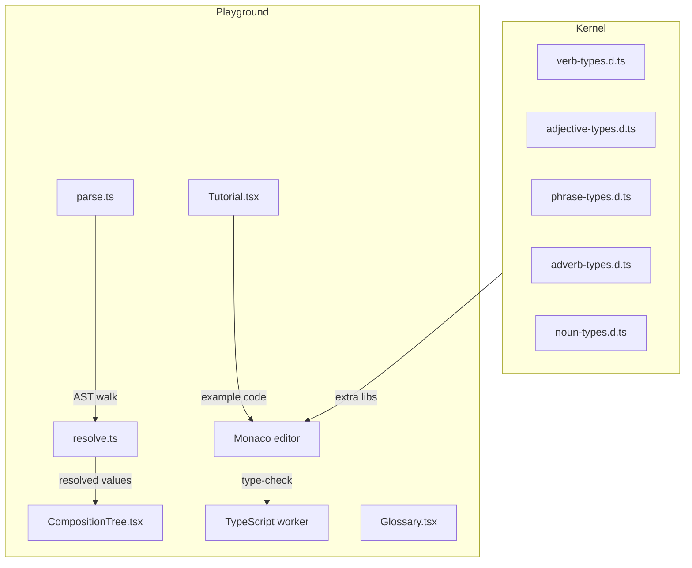

# Architecture

Active contributors: Yifeng Wang

Typed Japanese is split into a compile-time grammar kernel and a browser-based learning surface. The kernel is a set of TypeScript declaration files that encode Japanese morphology and syntax as generic types. The playground loads those declarations into a self-hosted Monaco editor and uses the TypeScript Compiler API to visualize how sentences are built.

## High-level components

## The type kernel

All grammar lives in declaration files under `src/`:

- `src/verb-types.d.ts` defines the three Japanese verb classes (godan, ichidan, irregular) and `ConjugateVerb<V, Form>`.
- `src/adjective-types.d.ts` defines i-adjectives and na-adjectives and `ConjugateAdjective<A, Form>`.
- `src/phrase-types.d.ts` defines particles, conditional phrases, interrogative phrases, connected phrases, and the `PhrasePart` builder API.
- `src/adverb-types.d.ts` and `src/noun-types.d.ts` provide small helper unions such as interrogative words and proper nouns.

`src/index.d.ts` re-exports everything. Because the library ships only `.d.ts` files, there is no runtime output. Consumers either import the types in a TypeScript project or load them as extra libs in Monaco.

## The playground

`playground/` is a Vite + React app. It contains three tabs:

1. **Grammar Course** — a bilingual 47-chapter tutorial where every example sentence is backed by a self-contained Typed Japanese snippet. See [`playground/src/tutorial/types.ts`](../../playground/src/tutorial/types.ts).
2. **Glossary** — a searchable vocabulary table with readings, romaji, part of speech, and bilingual meanings. See [`playground/src/vocab/dictionary.ts`](../../playground/src/vocab/dictionary.ts).
3. **Playground** — the live analyzer with a Monaco editor and a sentence structure tree. See [`playground/src/components/Analyzer.tsx`](../../playground/src/components/Analyzer.tsx).

The analyzer parses the editor source with `ts.createSourceFile`, builds a `CompositionNode` tree for the last declared type alias, and then asks Monaco's TypeScript worker to resolve each node to its string literal value. This means the Japanese shown in the tree is computed by the real compiler, not hard-coded.

## Design system

The UI uses the "Washi & Sumi" (和紙・墨) sakura theme documented in `playground/DESIGN.md`. Tokens are CSS custom properties in `playground/src/theme.css`. The same theme is mirrored on the public landing page, so the playground and the website read as one product.
