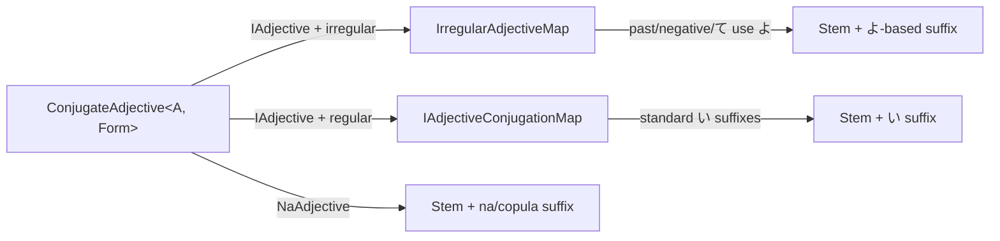

# Adjective conjugation

Active contributors: Yifeng Wang

Japanese adjectives fall into two classes: i-adjectives (い形容詞) and na-adjectives (な形容詞). This subsystem models both as type objects and provides `ConjugateAdjective<A, Form>` to resolve them to the correct string.

## Directory layout

```
src/
├── adjective-types.d.ts
└── examples/
    ├── example-adjective.ts
    └── example-phrase.ts
```

## Key abstractions

| Type | File | Purpose |
| --- | --- | --- |
| `IAdjective` | `src/adjective-types.d.ts` | Adjective with a stem and ending `い`; may be marked `irregular` |
| `NaAdjective` | `src/adjective-types.d.ts` | Adjective with a stem only; takes `な` when modifying a noun |
| `Adjective` | `src/adjective-types.d.ts` | Union of `IAdjective` and `NaAdjective` |
| `AdjectiveConjugationForm` | `src/adjective-types.d.ts` | Union of 基本形, 丁寧形, 過去形, 否定形, plus て形 for na-adjectives |
| `IAdjectiveConjugationMap` | `src/adjective-types.d.ts` | Standard i-adjective suffixes |
| `IrregularAdjectiveMap` | `src/adjective-types.d.ts` | Special case for いい (good) |
| `ConjugateAdjective<A, F>` | `src/adjective-types.d.ts` | Resolves an adjective to its conjugated form |

## How it works

For an i-adjective, the basic form is `${stem}い`. The standard map appends `いです` (polite), `かった` (past), or `くない` (negative). For the irregular adjective いい, the stem is also `い`, but the past and negative forms use the stem `よ` instead: よかった and よくない. The `irregular` flag in `IAdjective` selects this branch.

For a na-adjective, the basic form is `${stem}な`. Other forms are simpler: 丁寧形 = `${stem}です`, 過去形 = `${stem}でした`, 否定形 = `${stem}ではない`, and て形 = `${stem}で`.



## Integration points

- The phrase system imports `ConjugateAdjective` and the adjective types to build `AdjectivalPhrase` and `AdjectivePart`.
- The example `src/examples/example-adjective.ts` (if present) demonstrates basic conjugations. The adjective examples are also folded into `src/examples/example-phrase.ts` for phrase-level tests.

## Entry points for modification

- Add new adjective forms in `src/adjective-types.d.ts` by extending `AdjectiveConjugationForm` and updating the maps.
- Add new irregular adjectives by extending `IrregularAdjectiveMap` and adding an `irregular` flag to the input type.

## Key source files

| File | Purpose |
| --- | --- |
| `src/adjective-types.d.ts` | Adjective definitions and conjugation logic |
| `src/examples/example-phrase.ts` | Phrase-level examples that include adjective conjugation |
