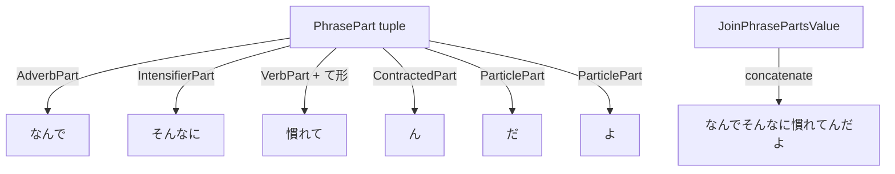

# Phrase composition

Active contributors: Yifeng Wang

This subsystem turns conjugated verbs and adjectives into larger Japanese units: phrases with particles, conditional sentences, interrogative questions, connected clauses, and arbitrary sequences of phrase parts.

## Directory layout

```
src/
├── phrase-types.d.ts
├── adverb-types.d.ts
├── noun-types.d.ts
└── examples/
    ├── example-phrase.ts
    └── example-why-intensifier.ts
```

## Key abstractions

| Type | File | Purpose |
| --- | --- | --- |
| `Particle` | `src/phrase-types.d.ts` | Union of all supported particles (は, が, を, に, へ, で, と, から, まで, よ, ね, か, よね, の, だ, も) |
| `ConditionalParticle` | `src/phrase-types.d.ts` | なら, たら, れば, と |
| `PhraseWithParticle<P, Particle>` | `src/phrase-types.d.ts` | Appends a particle to a string phrase |
| `ConditionalPhrase<Subject, CP, Result>` | `src/phrase-types.d.ts` | Builds `Subject + CP + Result` |
| `ConnectedPhrases<P1, P2>` | `src/phrase-types.d.ts` | Joins two phrases with the Japanese comma `、` |
| `InterrogativePhrase<Adv, Subject, V, VForm, QP>` | `src/phrase-types.d.ts` | Builds `Adv + Subject + ConjugateVerb + QP` |
| `DemonstrativeAction<Demo, V, Form>` | `src/phrase-types.d.ts` | Builds `Demo + ConjugateVerb<V, Form>` (e.g. そうした) |
| `PhrasePart` | `src/phrase-types.d.ts` | Union of typed part builders: verb, adjective, noun, adverb, particle, intensifier, contracted, nested phrase, punctuation |
| `JoinPhrasePartsValue<Parts>` | `src/phrase-types.d.ts` | Recursively concatenates the `value` fields of a `PhrasePart[]` tuple |
| `WhyInterensifierPatternWithEmphasis` | `src/phrase-types.d.ts` | Pre-built pattern for "なんでそんなに…てんだよ" style sentences |
| `InterrogativeAdverb` | `src/adverb-types.d.ts` | Union of question words (なぜ, なんで, どうして, いつ, どこ, etc.) |
| `ProperNoun<N>` | `src/noun-types.d.ts` | Simple alias for a proper noun string |

## How it works

The simplest constructors are template literal types. `PhraseWithParticle<Phrase, P>` is just `` `${Phrase}${P}` ``. `ConnectedPhrases` inserts the Japanese comma. `ConditionalPhrase` and `InterrogativePhrase` are similar concatenations, but they use the verb and adjective conjugation systems to resolve the middle pieces.

The `PhrasePart` builder is more flexible. Each part type carries a `value` field, and `JoinPhrasePartsValue<Parts>` recursively concatenates those values into a single string. This lets you assemble arbitrary sentences from a tuple of typed parts:

```typescript
type SentenceParts = [
  AdverbPart<"なんで">,         // why
  IntensifierPart<"そんなに">,   // so much
  VerbPart<慣れる, "て形">,     // get used to, te-form
  ContractedPart<"ん">,         // contraction of の
  ParticlePart<"だ">,            // copula
  ParticlePart<"よ">             // emphasis
];

type JoinedSentence = JoinPhrasePartsValue<SentenceParts>;
// Evaluates to "なんでそんなに慣れてんだよ"
```

This is the mechanism behind `WhyIntensifierPatternWithEmphasis`, which packages the same six parts into a single helper type.



## Integration points

- The verb and adjective systems are imported for `VerbPart`, `AdjectivePart`, `ConjugateVerb`, and `ConjugateAdjective`.
- The playground analyzer recognizes all compositional constructor names (`ConditionalPhrase`, `ConnectedPhrases`, `InterrogativePhrase`, etc.) and expands them into `CompositionNode` trees. See `playground/src/analysis/parse.ts`.
- The course examples in `playground/src/tutorial/chapters/` are self-contained snippets that use these phrase types to build real sentences.

## Entry points for modification

- To add a new particle, extend the `Particle` union in `src/phrase-types.d.ts` and update `playground/src/analysis/parse.ts` if it needs a category in the analyzer.
- To add a new sentence pattern, either add a new constructor type or use the `PhrasePart` tuple builder.
- To add a new interrogative word, extend the unions in `src/adverb-types.d.ts`.

## Key source files

| File | Purpose |
| --- | --- |
| `src/phrase-types.d.ts` | Phrase constructors, particles, and the `PhrasePart` builder |
| `src/adverb-types.d.ts` | Interrogative adverbs and demonstratives |
| `src/noun-types.d.ts` | Proper noun helper |
| `src/examples/example-phrase.ts` | Conditional, interrogative, and connected phrase examples |
| `src/examples/example-why-intensifier.ts` | `WhyIntensifierPatternWithEmphasis` and `PhrasePart` tuple example |
