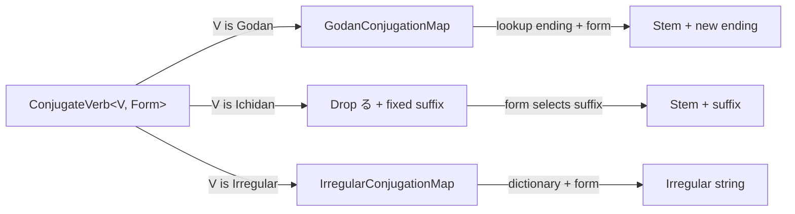

# Verb conjugation

Active contributors: Yifeng Wang

This subsystem models Japanese verb classes and conjugation entirely with TypeScript types. A verb is an object type with a `type` discriminator; the `ConjugateVerb<V, Form>` generic resolves the correct kana string by looking up the verb's ending or dictionary form.

## Directory layout

```
src/
├── verb-types.d.ts    # all verb types and conjugation rules
└── examples/
    └── example-verb.ts   # runnable examples with @ts-expect-error checks
```

## Key abstractions

| Type | File | Purpose |
| --- | --- | --- |
| `GodanVerb` | `src/verb-types.d.ts` | Five-row verb with a stem and one of 9 possible endings |
| `IchidanVerb` | `src/verb-types.d.ts` | Ru-verb with a stem and ending `る` |
| `IrregularVerb` | `src/verb-types.d.ts` | One of `する`, `来る`, or `くる` |
| `ConjugationForm` | `src/verb-types.d.ts` | Union of 12 named forms such as て形, た形, 命令形 |
| `GodanConjugationMap` | `src/verb-types.d.ts` | Lookup table from ending + form to the new ending kana |
| `IrregularConjugationMap` | `src/verb-types.d.ts` | Full form table for each irregular dictionary form |
| `ConjugateVerb<V, F>` | `src/verb-types.d.ts` | Main entry point that resolves a verb to its conjugated string |

## How it works

`ConjugateVerb` is a conditional type that branches on the verb class first, then on the requested form.

For a godan verb, the dictionary form is always `${stem}${ending}`. For any other form, the type looks up `GodanConjugationMap[ending][form]` and appends it to the stem. For example, `買う` (stem `買`, ending `う`) maps て形 to `って`, producing `買って`.

For an ichidan verb, the dictionary form is `${stem}る`. Other forms drop the trailing `る` and attach a fixed suffix: て形 becomes `${stem}て`, た形 becomes `${stem}た`, 命令形 becomes `${stem}ろ`, and potential/passive/causative/conditional/hypothetical all become `${stem}られ`.

For irregular verbs, `ConjugateVerb` delegates to `GetIrregularConjugation`, which indexes `IrregularConjugationMap` by the verb's `dictionary` field and the requested form. This is the only place where the result can differ from the simple stem-plus-suffix pattern, which is why する → て形 = して and 来る → 命令形 = 来い.



## Integration points

- The phrase system in `src/phrase-types.d.ts` imports `ConjugateVerb`, `Verb`, and the verb class types to build `VerbPhrase`, `InterrogativePhrase`, `ConditionalPhrase`, and `DemonstrativeAction`.
- The playground loads `verb-types.d.ts` as an extra lib via `playground/src/data/libSources.ts` so Monaco can resolve types like `ConjugateVerb<話す, "て形">` in the browser.
- The examples in `src/examples/example-verb.ts` use `@ts-expect-error` to assert that incorrect conjugations are rejected.

## Entry points for modification

- To add a new verb class or form, extend the unions in `src/verb-types.d.ts` and update the corresponding map.
- To add a new example verb, add it to `src/examples/example-verb.ts` and include a matching `@ts-expect-error` test if it exercises an error case.

## Key source files

| File | Purpose |
| --- | --- |
| `src/verb-types.d.ts` | Verb definitions and conjugation logic |
| `src/examples/example-verb.ts` | Godan, ichidan, and irregular examples with compile-time checks |
